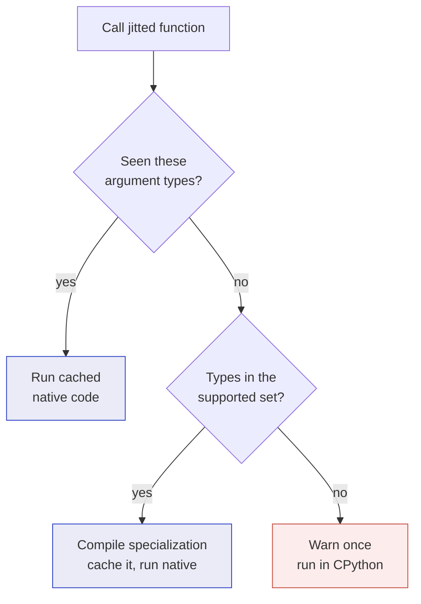
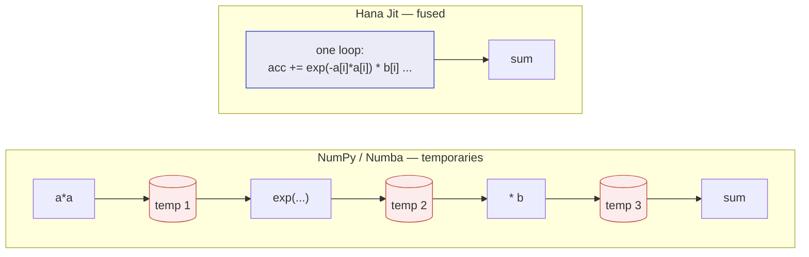
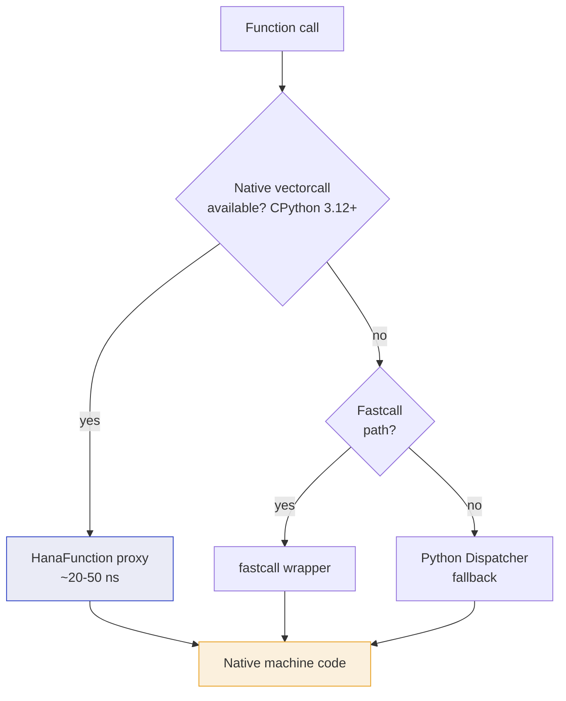
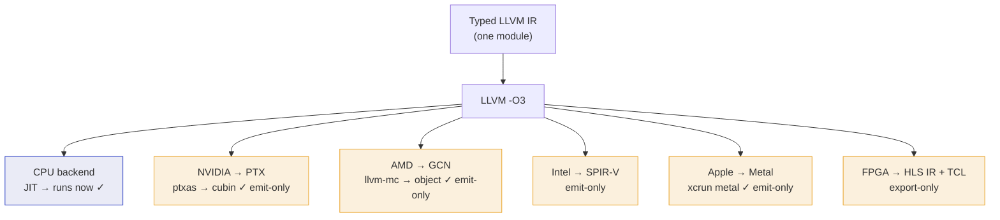
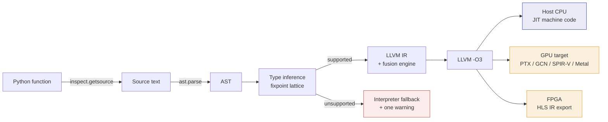

<div align="center">

# Hana Jit

**An LLVM-backed JIT compiler for Python. It compiles ordinary functions and NumPy code to native machine code, and falls back to the interpreter for code it cannot compile.**

[](https://github.com/ezducate/HanaJit/actions/workflows/ci.yml)
[](https://www.python.org/)
[](LICENSE)
[](#status)

</div>

## The name

**Hana Jit** — **هانا جيت** — is written as two words, and is a bilingual play on words.

- **Hana** — from Moroccan Arabic (Darija) **ها أنا** *(ha ana)*, meaning "here I am."
- **Jit** — **JIT**, as in a Just-In-Time compiler. In Moroccan Arabic, **جيت** *(jit)* means "I arrived."

Read either way, "Hana Jit" resolves to "here I am, a JIT compiler" or "here I am, I've arrived." The installable package is named `hanajit` (PyPI names cannot contain spaces).

---

## Overview

Hana Jit compiles a Python function to native machine code through [LLVM](https://llvm.org/) (via [llvmlite](https://llvmlite.readthedocs.io/)) and runs that in place of the interpreter. Typical results are 10–100× faster than CPython, and comparable to [Numba](https://numba.pydata.org/) on the workloads it targets.

It requires no type annotations, no restructured data, and no new language. Add a decorator:

```python
from hanajit import jit

@jit
def sum_squares(x):
    total = 0.0
    for i in range(len(x)):
        total += x[i] * x[i]
    return total
```

The first call with a given argument type compiles a specialization; subsequent calls with the same types reuse it. Code that Hana Jit cannot compile falls back to the CPython interpreter with a single warning, so existing programs continue to run.




Design goals:

1. **No DSL.** It compiles the Python you wrote, parsed by CPython's own `ast` module — not a restricted dialect or a new syntax.
2. **Correctness.** Every optimization is either provably equivalent to the original code, or an opt-in trade-off (such as float32 precision) documented with its exact cost. Code that cannot be compiled safely runs in the interpreter rather than being miscompiled.
3. **Reproducible measurement.** The benchmark figures below are measured and reproducible from the scripts in [`benchmarks/`](benchmarks/).

Hana Jit was developed in the R&D pipeline at [EZducate](https://ezducate.ai) to accelerate numeric and array-heavy code — on-device inference, simulation, and data processing.

---

## Status

Hana Jit is alpha software. The CPU compiler is stable and tested: **217 tests pass across Python 3.10–3.14 on Linux, Windows 11, and macOS (Apple Silicon).** GPU support is code generation only — it emits GPU assembly that vendor toolchains accept, but does not yet launch kernels on a GPU (see [Limitations](#limitations)). APIs may change before 1.0; pin a version if you depend on it.

---

## Installation

Requires Python 3.10 or newer. The only dependency is `llvmlite`, which ships prebuilt LLVM wheels for all major platforms. A separate LLVM installation is not required.

**From PyPI:**

```bash
pip install hanajit
```

**From GitHub:**

```bash
pip install "git+https://github.com/ezducate/HanaJit.git"

# pin to a released tag
pip install "git+https://github.com/ezducate/HanaJit.git@v0.20.1"
```

**For development:**

```bash
git clone https://github.com/ezducate/HanaJit.git
cd HanaJit
pip install -e ".[test]"      # editable install with test dependencies
python -m pytest tests/ -q    # run the suite
python -m hanajit.doctor      # environment and capability diagnostic
```

Optional extras: `hanajit[bench]` adds `numba` and `scipy` for the comparison benchmarks; `hanajit[test]` adds the test dependencies.

---

## Features

All features beyond the base `@jit` decorator are opt-in.

### Base decorator

```python
from hanajit import jit
import numpy as np

@jit
def norm(x):
    total = 0.0
    for i in range(len(x)):
        total += x[i] * x[i]
    return total ** 0.5

norm(np.random.rand(1_000_000))
```

The first call with a given argument type compiles a specialization; later calls with the same types reuse it. A call with a different type compiles a separate specialization.

### Fusion engine

A NumPy expression normally allocates a temporary array for every operation (`a * b` produces one array, `+ c` another). Numba does the same. Hana Jit compiles the entire expression into a single loop with no intermediate arrays:

```python
@jit
def score(a, b):
    # compiled to one pass over the data; no temporary arrays are allocated
    return np.sum(np.exp(-a * a) * b + np.where(a > 0, a, 2 * a) - np.clip(b, 0.2, 1.5))
```

This is a structural difference rather than a flag, so it is not affected by Numba tuning options. On a 5-operation expression, Hana Jit runs about 3× faster than NumPy and 3.7× faster than Numba.




The engine supports ufuncs (`exp`, `sqrt`, `sin`, …), comparisons, `np.where`, `np.clip`, `np.minimum`/`maximum`, and virtual arrays such as `np.arange` and `np.linspace` that are never materialized. Operations outside its scope fall back.

### `reduce_reassoc`

A summation loop (`total += x[i]`) cannot be vectorized by default because each iteration depends on the previous one. NumPy reorders its summation (pairwise) to work around this. `reduce_reassoc=True` grants Hana Jit the same reordering permission, applied only to reduction accumulators:

```python
@jit(reduce_reassoc=True)
def total(x):
    acc = 0.0
    for i in range(len(x)):
        acc += x[i]          # vectorizes into parallel SIMD accumulators
    return acc
```

This reaches NumPy-class reduction throughput (about 1.5× the default) without enabling global fast-math. Integer reductions remain bit-exact. Float reductions are reordered the same way NumPy reorders them, matching NumPy to approximately 1 part in 10¹⁰ — not identical to a strict left-to-right sum, but no less accurate than `np.sum`. It also applies to `np.sum`, `np.dot`, and `np.mean`.

### float32

A `float32` array compiles with 32-bit arithmetic: half the memory traffic and twice the SIMD lane count of float64. The dtype selects the path; no flag is required:

```python
@jit(reduce_reassoc=True)
def total(x):
    acc = 0.0
    for i in range(len(x)):
        acc += x[i]
    return acc

total(x.astype(np.float32))   # 32-bit compute path
```

On a memory-bound reduction, float32 with `reduce_reassoc` runs about 2.7× the float64 baseline. The result carries float32 precision (approximately 7 significant digits) — a bounded trade-off, equivalent to computing in float32 elsewhere. Use it where float32 precision is sufficient.

### narrow (experimental)

The integer companion to float32 mode. For a memory-bandwidth-bound integer reduction over a large 1-D `int8` / `int16` / `int32` array, narrow mode loads the narrow elements as SIMD vectors and accumulates in a wide `int64` vector — moving far fewer bytes per element while keeping the result exact:

```python
import numpy as np
from hanajit import jit

@jit
def total(x):
    acc = 0
    for i in range(len(x)):
        acc += x[i]
    return acc

data = np.random.default_rng(0).integers(-100, 100, 50_000_000).astype(np.int8)
result = total.narrow(data, confirmed=True)   # exact int64 sum, ~3× faster
```

The result is bit-identical to the `int64` sum because accumulation is always 64-bit — there is no accumulator overflow (the failure mode of naive narrowing, where an `int8` accumulator wraps around). On a memory-bound sum, measured speedups are roughly `int8` 2.3–3.2×, `int16` 2.0–2.3×, and `int32` 1.5× over an `int64` baseline; these are bandwidth-dependent and vary by hardware.

This mode is experimental and opt-in: it requires `confirmed=True`, exactly like the hyper-aggressive optimizer. Unlike hyper mode, the result is exact — what is experimental is the specialized codegen path and the requirement that the input already be a narrow-dtype array. It currently accelerates the sum reduction over one narrow array; other patterns fall back to the normal compiler with a warning. `int4` and `int2` are not supported on CPU, because there are no sub-byte SIMD load instructions and the bit-unpacking they require eats the bandwidth saving.

For a worked scientific example, [`examples/rdf_narrow.py`](examples/rdf_narrow.py) computes protein-water coordination numbers (a radial distribution function analysis) on a real solvated protein, using `narrow` to reduce millions of per-pair `int8` indicators — the memory-bound integer sum that narrow targets.

### Genetic optimizer

Different CPUs favor different compilation choices (unroll factors, vectorization widths). `evolve()` runs a genetic search over compilation strategies, times each candidate on the current hardware with the supplied data, and installs the fastest:

```python
f = jit(heavy_kernel)
f(example_args)                    # compile
report = f.evolve(example_args)    # search; installs the winner
print(report["speedup"])
```

Every candidate is guaranteed to compute the same result: the genes are semantics-preserving transforms, and each candidate is checked against the baseline before it is timed. In the benchmarks below it is consistently the largest correctness-preserving gain, up to approximately 5× on some kernels.

### Parallelism

```python
from hanajit import jit, prange

# auto-parallelize the outermost loop
@jit(parallel=True)
def process(x, out):
    for i in range(len(x)):
        out[i] = expensive(x[i])
    return 0

# or use prange explicitly
@jit
def process2(x, out):
    for i in prange(len(x)):
        out[i] = expensive(x[i])
    return 0
```

`@jit(nogil=True)` releases the GIL around a kernel so it can run alongside other Python threads. `pmap` parallelizes a function across a batch of argument tuples. Measured speedups on multi-core machines are in the 1.8–3.6× range; memory bandwidth is typically the limiting factor.

### Dispatch overhead

On CPython 3.12+, each jitted function becomes a native vectorcall object whose dispatch is itself compiled machine code. Call overhead is approximately 20–50 nanoseconds, about 3.6× less than Numba.




### Helper inlining

A small `@jit` function called from another `@jit` function is inlined at the source level before compilation, removing call overhead and allowing the fusion engine to see through it:

```python
@jit
def sq(x):
    return x * x

@jit
def energy(a):
    total = 0.0
    for i in range(len(a)):
        total += sq(a[i]) + sq(a[i] + 1)   # sq() is inlined
    return total
```

### Experimental features

Three features are gated behind explicit opt-ins because they carry additional risk. All are documented in [`docs/experimental.md`](docs/experimental.md).

**`@jit(rewrite=True)`** applies pattern-matched algebraic rewrites — for example, a loop summing an arithmetic series is replaced by its closed-form expression. Each rewrite is individually proven correct and fires only on an exact pattern match.

**`evolve_hyper(..., confirmed=True)`** extends `evolve()` with unsafe floating-point transforms (aggressive reassociation, reciprocals, approximate functions). It keeps the fastest candidate that matches the original within a tolerance across a large batch of random inputs. It does not guarantee correctness on untested inputs, requires `confirmed=True`, and is never cached. In the benchmark table below it is frequently a no-op, because the safe `evolve()` has usually already reached the hardware limit. It is intended for kernels where the aggressive transforms unlock additional gains, and should not be used where an incorrect result is unacceptable.

**`narrow(..., confirmed=True)`** (see the [narrow section](#narrow-experimental) above) accelerates a memory-bound integer sum over an `int8` / `int16` / `int32` array using narrow SIMD loads with wide accumulation. Unlike the two features above, its result is always exact; the opt-in reflects the specialized codegen path and the narrow-storage requirement, not a correctness trade-off.

---

## Benchmarks

Measured on a single core in a shared CI container. Treat the ratios as the signal; absolute milliseconds are noisy — rerun on target hardware with the scripts in [`benchmarks/`](benchmarks/). Compared against NumPy 2.x and Numba 0.66.

### Summary

| Benchmark | Result |
|---|---|
| 5-operation fused NumPy expression | 3.0× vs NumPy, 3.7× vs Numba |
| Reduction, `reduce_reassoc` (float64) | ~1.5× over the default |
| Reduction, `reduce_reassoc` + float32 | ~2.7× over the float64 baseline |
| Reduction, `narrow` int8 (memory-bound sum) | ~2.3–3.2× over the int64 baseline |
| Reduction, `narrow` int16 (memory-bound sum) | ~2.0–2.3× over the int64 baseline |
| `evolve()` genetic optimizer | up to ~5×, correctness-verified |
| Call / dispatch overhead | ~46 ns (3.6× less than Numba) |
| `fib(30)` recursion | 1.7× vs Numba |

### With GA, without GA, hyper-aggressive, and Numba

The same kernel compiled four ways:

| Workload | Hana Jit (plain) | + `evolve()` (safe GA) | + hyper-aggressive | Numba |
|---|---|---|---|---|
| fp reduction | 0.78 ms | **0.23 ms** | 0.79 ms | 0.74 ms |
| poly5 eval | 1.04 ms | **0.22 ms** | 1.01 ms | 0.96 ms |
| transcendental | 3.46 ms | 3.50 ms | 3.46 ms | 3.42 ms |
| dot product | 0.80 ms | **0.31 ms** | 0.37 ms | 0.74 ms |

Notes:

- On scalar loops, plain Hana Jit and Numba are approximately equal, as they share the LLVM backend. Hana Jit's advantages are in fusion, dispatch, float32, and cold start.
- The safe GA (`evolve()`) is the largest gain — up to ~4-5× — and exceeds Numba on every row with available headroom, while guaranteeing an identical result.
- The hyper-aggressive column is frequently a no-op and in some rows slower than the safe GA, because the safe GA already reaches the hardware limit on these kernels. Recommendation: use the safe GA; the hyper-aggressive mode applies only to the narrow set of kernels where the unsafe transforms yield further gains.
- The transcendental row barely changes in any column, as it is bound by the hardware `exp`/`sqrt` units.

Reproduce:

```bash
pip install "hanajit[bench]"
python benchmarks/bench_experimental.py    # rewrite + hyper-aggressive
python benchmarks/bench_reductions.py      # reduce_reassoc + float32
python benchmarks/fourway.py               # the four-way comparison
```

---

## Architecture

Hana Jit is approximately 3,000 lines of Python. One intermediate representation, multiple targets:

1. **Frontend** — `inspect.getsource` + `ast.parse` produce the exact tree CPython would execute. There is no custom parser.
2. **Type inference** — a fixpoint over a small set of types (`int64`, `float64`, `float32`, `bool`, pointers, array shapes). Anything outside the set raises an internal `UnsupportedError`, which becomes a fallback to the interpreter.
3. **Code generation** — the typed tree lowers to LLVM IR, including the fusion engine that compiles array expressions into element generators fused into one loop.
4. **Backends** — the IR module is optimized (`-O3`) and either JIT-compiled for the host CPU, re-targeted for a GPU, or exported for FPGA synthesis.



The CPU backend runs compiled code directly. The GPU backends emit and assemble vendor-valid code but do not launch kernels (see [Limitations](#limitations)); the FPGA path exports IR for external synthesis.




See [`docs/architecture.md`](docs/architecture.md) for detail.

---

## FPGA export

An FPGA is not a processor that executes an instruction stream; it is reconfigurable hardware. An algorithm targeting an FPGA is synthesized into a circuit — loops become pipelined datapaths, multiplies map to DSP blocks, arrays to on-chip memory. Synthesis requires a licensed toolchain and produces a bitstream that configures the device. This process is ahead-of-time and cannot be performed just-in-time.

Hana Jit's role is limited to producing HLS-compatible LLVM IR. The `export_fpga` method writes two files:

```python
from hanajit import jit

@jit
def saxpy(y, x, a, n):
    for i in range(n):
        y[i] = a * x[i] + y[i]
    return 0

saxpy(y, x, 2.0, len(y))                 # compile first
ll_path, tcl_path = saxpy.export_fpga("out/saxpy")
print(ll_path)    # out/saxpy.ll        — self-contained LLVM IR
print(tcl_path)   # out/saxpy_hls.tcl   — a Vitis HLS project script
```

- **`<prefix>.ll`** is the typed LLVM IR used by the CPU and GPU backends. The FPGA HLS tools accept this format: AMD/Xilinx Vitis HLS is built on LLVM and ingests IR through its front-end flow, and LLVM's [CIRCT](https://circt.llvm.org/) project lowers LLVM IR to hardware dialects (FIRRTL/Calyx) and emits Verilog.
- **`<prefix>_hls.tcl`** is a Vitis HLS project script that sets the top function, targets a board (an Alveo U250 by default), sets a clock constraint, runs synthesis, and exports an IP block. It is a scaffold to be tuned with HLS pragmas.

### Testing the FPGA export

The export can be tested without FPGA hardware or a licensed toolchain:

```python
import numpy as np
from hanajit import jit

@jit
def dot(a, b, n):
    s = 0.0
    for i in range(n):
        s += a[i] * b[i]
    return s

a = np.ones(64); b = np.ones(64)
dot(a, b, 64)                                    # compile
ll, tcl = dot.export_fpga("dot_export")          # writes dot_export.ll + .tcl

print(open(ll).read()[:400])                     # LLVM IR
print(open(tcl).read())                          # Vitis HLS script
```

With the Vitis toolchain and a board, the next step is `vitis_hls -f dot_export_hls.tcl`, followed by place-and-route to a bitstream — steps that occur in AMD's tools, outside Hana Jit. The export path is tested (the files are written and the IR is self-contained); no bitstream is produced in CI, as that requires Vitis and hardware.

---

## Limitations

**Supported:** numeric code, loops, recursion, scalar math, and a subset of NumPy (elementwise operations, the fusion-engine operations, reductions, slicing, 1-D and 2-D indexing, `float32`/`float64`/`int64` arrays).

**Falls back to the interpreter** (with one warning): allocating new arrays inside a kernel, most of the object model (classes, dictionaries, arbitrary objects), generators, exceptions as control flow, string manipulation, `float16`/`complex` dtypes, and the remainder of the NumPy API. Hana Jit targets numeric kernels; code outside that scope runs in the interpreter.

**GPU is code generation only.** Hana Jit emits GPU assembly for four targets — NVIDIA (PTX), AMD (GCN), Intel (SPIR-V), and Apple (Metal) — and this output is validated by the vendor toolchains: NVIDIA `ptxas` assembles the PTX into a cubin, LLVM's AMDGPU `llvm-mc` assembles the GCN into an object file, and `xcrun metal` compiles the Metal source on Apple Silicon. Hana Jit does not launch kernels on a GPU. The host-side machinery to allocate device memory, transfer data, and dispatch the kernel (`cuLaunchKernel` and equivalents) is not implemented. The GPU backends are a validated compiler target, not a runtime. Documentation describes this as "emits and assembles," not "runs on GPU."

**FPGA is export only** — see the section above. It writes IR and an HLS script; synthesis occurs in external tools.

**Numerical behavior:** `reduce_reassoc` reorders float additions (as NumPy does), so results are not bit-identical to a sequential sum but remain within NumPy-level tolerance; integers are unaffected. `float32` carries float32 precision. `evolve_hyper` does not guarantee correctness on untested inputs.

See [`docs/limitations.md`](docs/limitations.md) for the full list.

---

## Diagnostics

```bash
python -m hanajit.doctor
```

The diagnostic checks compilation, dispatch, threading, caching, and the GPU code-generation backends. If `ptxas` or `llvm-mc` are on the PATH, it runs the vendor assemblers to validate the generated GPU code. It writes `hanajit_report_<platform>.md`. Example reports for Linux, Windows, and macOS are in [`reports/`](reports/).

---

## Documentation

- [`docs/quickstart.md`](docs/quickstart.md) — walkthrough
- [`docs/api.md`](docs/api.md) — full API reference
- [`docs/architecture.md`](docs/architecture.md) — compiler internals
- [`docs/gpu.md`](docs/gpu.md) — GPU backends and validation
- [`docs/performance.md`](docs/performance.md) — benchmark detail
- [`docs/numpy-coverage.md`](docs/numpy-coverage.md) — supported NumPy operations
- [`docs/experimental.md`](docs/experimental.md) — experimental features
- [`docs/limitations.md`](docs/limitations.md) — full limitations list
- [`docs/publishing.md`](docs/publishing.md) — release process
- [`examples/`](examples/) — example programs

---

## Contributing

Issues and pull requests are welcome. Run the suite before submitting:

```bash
pip install -e ".[test]"
python -m pytest tests/ -q
```

New optimizations must include tests that verify the result against a reference before any performance claim. Contributions are accepted under the repository's license.

---

## License

Apache License 2.0 — see [`LICENSE`](LICENSE).

---

## Acknowledgements

Built on [LLVM](https://llvm.org/) and [llvmlite](https://llvmlite.readthedocs.io/). Benchmarked against [NumPy](https://numpy.org/) and [Numba](https://numba.pydata.org/). The helper-inlining and auto-parallelization features were informed by [Taichi](https://github.com/taichi-dev/taichi), implemented without a DSL. Developed at [EZducate](https://ezducate.ai).
